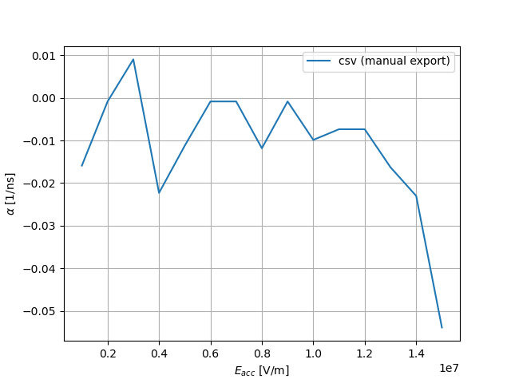
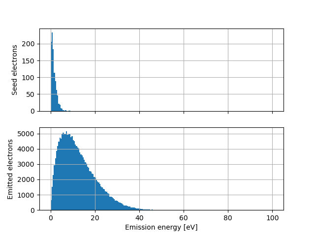
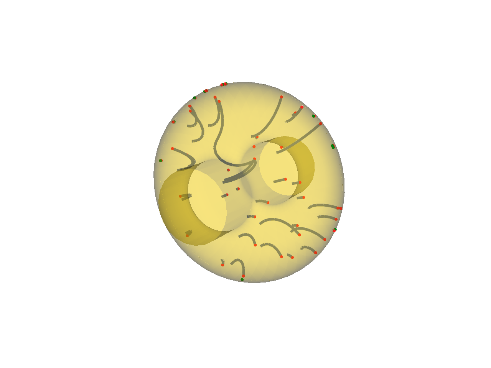

# About this package
This package is a set of utils oriented towards multipacting analysis.
In particular:
 - Load parameter sweeps and PIC Position Monitor data from CST Particle Studio.
 - Load results from SPARK3D.
 - Post-treat electron vs time results from these tools: multipactor trend, (TODO: multipactor order).
 - Post-treat CST's PIC Position Monitor:
  - Distribution of emission energies.
  - Distribution of impact energies.
  - Distribution of impact angles.
  - Visualise trajectories.

# Installation
## Requirements
You will need a recent version of Python (at least 3.12).

## Installation
### Simple installation:
```
pip install simultipac
```

> [!WARNING]
> The package is not on PyPI yet, prefer building from source.

### Building form source
#. Navigate to the library installation folder.
#. `git clone git@github.com:AdrienPlacais/Simulia_Multipactor_lib.git` (or download it a `zip`).
#. Navigate to `Simulia_Multipactor_lib`
#. Create a dedicated python environment.
#. `pip install -e .`

# How to use
## Documentation
Documentation is available at [this link](https://adrienplacais.github.io/Simulia_Multipactor_lib/html/index.html).

## Tutorial
Examples are provided in the `examples` folder and in the documentation (work in progress).

# Gallery
## Compute exponential growth factor
### From SPARK3D


### From CST
Results of a parametric study on the number of seed electrons.


## Treat CST PIC Monitor data
### Emission energies


### Collision energies


### Collision angles


### Trajectory plots
Here we represented in red the collision points and in green the emission points.
Electrons without a green point are seed electrons.




